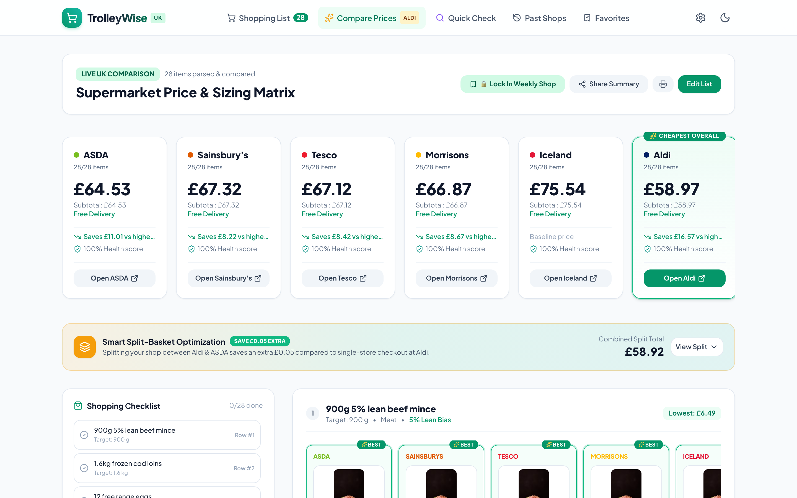
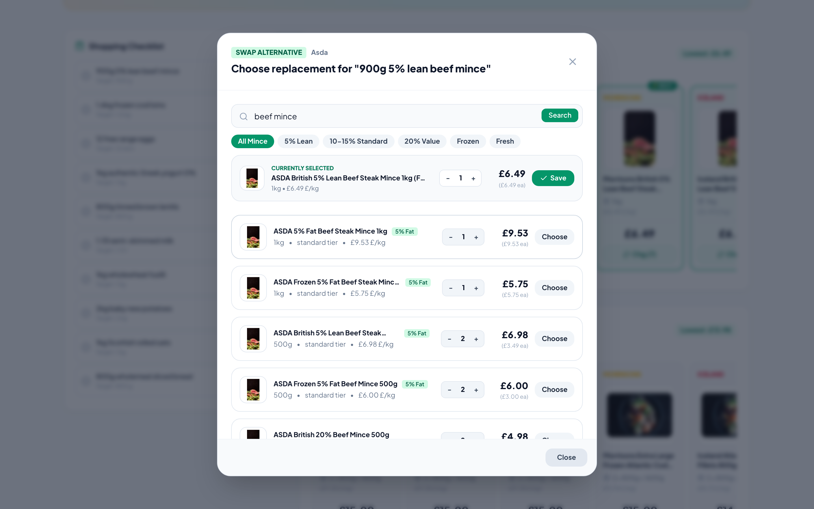
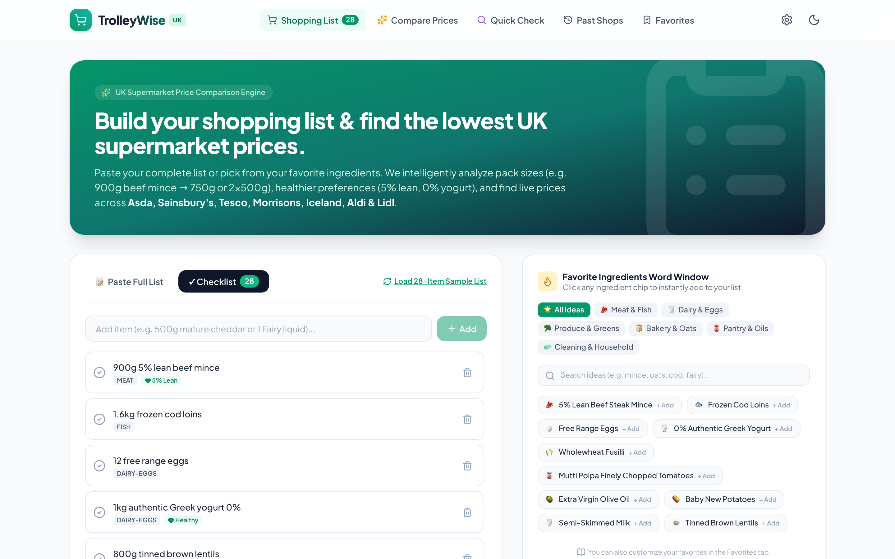
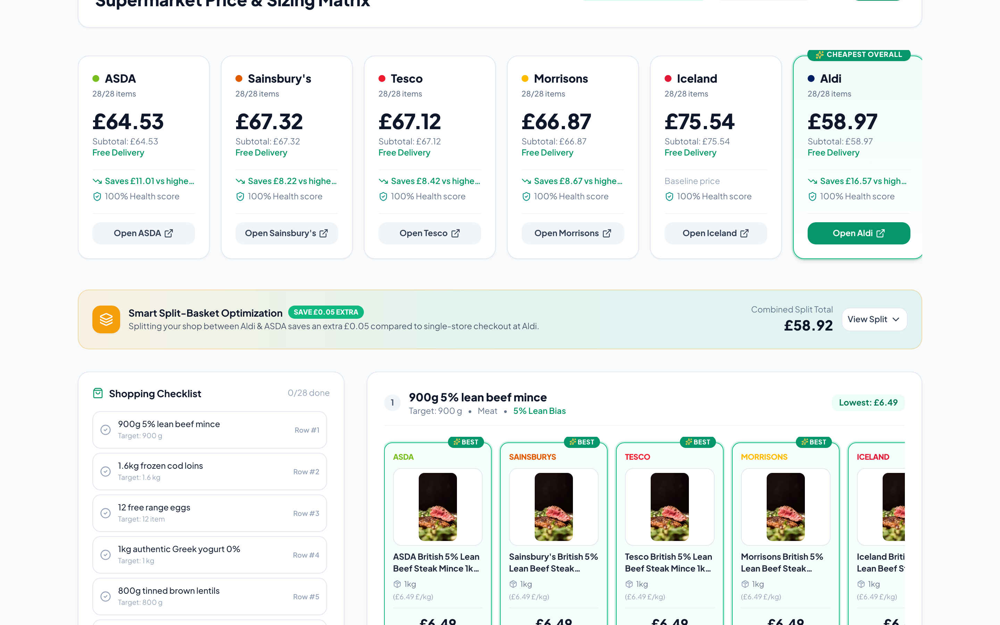

# TrolleyWise UK 🛒

[](https://github.com/knowlesy/shopping-comparison/actions/workflows/ci.yml)
[](https://github.com/knowlesy/shopping-comparison/actions/workflows/owasp.yml)
[](https://nodejs.org/)
[](docker-compose.yml)

A high-performance grocery price comparison and basket optimization engine for UK shoppers. Compare real product prices, packaging configurations, closest-weight sizing, and healthier dietary alternatives across 7 major UK supermarkets: **ASDA**, **Tesco**, **Sainsbury's**, **Morrisons**, **Iceland**, **Aldi**, and **Lidl**.

---

## 📸 Application Preview

| Multi-Store Price Matrix | Smart Item Swap Modal |
| :---: | :---: |
|  |  |

| Smart Shopping List Input | Split-Basket Optimization |
| :---: | :---: |
|  |  |

---

## ⚡ What It Does

- **Smart NLP List Parsing**: Parses free-form grocery text into structured items, weights (`g`, `kg`), volumes (`ml`, `L`, pints), multi-pack multipliers (`3 x 400g`), and dietary preferences (`5% lean`, `0% Greek yogurt`, wholewheat, free range, organic).
- **Multi-Store Comparison Matrix**: Evaluates and normalizes unit prices (`£/kg`, `£/L`) across 7 UK supermarkets with delivery thresholds.
- **UK Promotion & Deal Engine**: Computes accurate multibuy fixed prices (`3 for £2`), bundle discounts (`Save £1 on 2`), BOGOF, and loyalty schemes (Tesco Clubcard & Sainsbury's Nectar).
- **Food-Form Safety Guard**: Data-driven rules eliminate cross-category contamination (no Scotch eggs for fresh eggs, crisps for potatoes, or dessert pots for plain Greek yogurt).
- **Interactive Item Swapping**: Swap any matched product with alternative pack sizes, brand tiers, or cuts with instant basket recalculation.
- **Two-Store Split Optimizer**: Identifies maximum combined savings when dividing shopping items across two nearby stores.
- **72h Search Lifecycle & Historical Stats**: Persists active searches for 72 hours, auto-promotes expiring searches, and tracks 90-day per-item price trends (excluding estimated data).
- **Hybrid AI Fallback**: Optional `gemini-2.5-flash` integration for borderline or ambiguous query matching.

---

## ⚠️ Current Limitations

- **Live Scraper Network Requirements**: Live price aggregation requires direct host network access to UK supermarket endpoints; when running offline or in network-isolated sandboxes, the engine gracefully falls back to the labeled offline benchmark catalog.
- **No Automated Checkout**: The application calculates and optimizes basket pricing, but does not automate store logins or place orders on retailer websites.
- **Regional Supermarket Variation**: Prices and promotional availability may vary by store branch and geographic postcode.

---

## 🗺️ Roadmap & Planned Features

- [ ] **1-Click Retailer Cart Export**: Deep-link ingredients directly into supermarket online shopping carts.
- [ ] **Postcode-Aware Pricing**: Local store inventory and regional price variation indexing.
- [ ] **Price Drop & Promotion Alerts**: Automated notifications when tracked staple items go on sale.
- [ ] **Budget-Constrained Recipe Meal Planner**: Automatically scales recipes to fit a target weekly budget.

---

## 📐 Architecture & Documentation

- [**System Architecture & Technical Specs**](docs/architecture.md): Deep-dive into microservices, data models, and scoring algorithms.
- [**User Journey & Interactive Workflows**](docs/user-journey.md): Visual UI process flows, state transitions, and modal interactions.
- [**CI/CD & Security Pipelines**](docs/workflows.md): Concurrency cancellation, release-gated container publishing, and OWASP audit architecture.

---

## 🚀 Quick Start (Docker Compose — Recommended)

The canonical stack consists of two isolated microservices and a client SPA:
1. **`client`**: React 18 + Vite + Tailwind UI (`http://localhost:5173`)
2. **`logic-api`**: Comparison engine, NLP parsing, and basket optimizer (`http://localhost:3001`)
3. **`scraper-pod`**: Sandboxed Chromium scraping engine (`http://scraper-pod:3002`)

### 1. Launch Services
```bash
cp .env.example .env
docker compose up --build -d
```
Open **`http://localhost:5173`** in your browser.

---

## 💻 Local Development (Without Docker)

```bash
# 1. Install dependencies
npm install
npm --prefix client install
npm --prefix services/logic-api install
npm --prefix services/scraper-pod install

# 2. Run all services concurrently
npm run dev
```

---

## 🧪 Testing & Verification

```bash
# Run unit test suite (110 node:test tests)
npm test

# Run ESLint & Catalog integrity validator
npm run lint

# Run full audit verification harness (all 10 steps)
npm run verify:audit

# Compile production client build
npm run build
```

---

## 📦 Releases & Versioning

Releases follow [Semantic Versioning](https://semver.org/). To cut a new release:
1. Bump `"version": "x.y.z"` in all `package.json` files and add a release entry in `CHANGELOG.md`.
2. Commit and push a tag: `git tag vx.y.z && git push origin vx.y.z`.
3. GitHub Actions automatically builds and publishes container images tagged with the release version to `ghcr.io`.

---

## 📄 License

See the [LICENSE](LICENSE) file for details.
