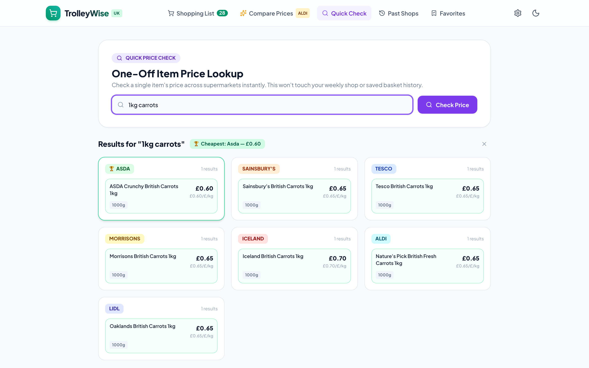
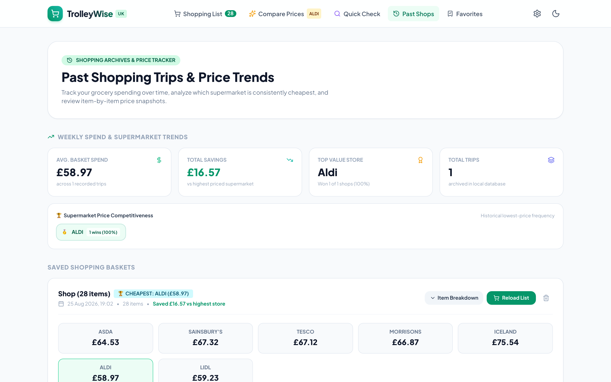

# TrolleyWise UK 🛒

[](https://github.com/knowlesy/shopping-comparison/actions/workflows/ci.yml)
[](LICENSE)
[](https://nodejs.org/)
[](docker-compose.yml)

A high-performance grocery price comparison and basket optimization application for UK supermarket shoppers. Compare real product prices, packaging configurations, closest-weight sizing, and healthier dietary alternatives across 7 major UK supermarkets: **ASDA**, **Tesco**, **Sainsbury's**, **Morrisons**, **Iceland**, **Aldi**, and **Lidl**.

---

## 📸 Application Preview

### 1. Live Supermarket Price & Sizing Matrix
Side-by-side comparison across all 7 UK stores with unit prices (£/kg, £/L), package configurations, and delivery fee thresholds.


### 2. Smart NLP Shopping List & Ingredient Parser
Extracts quantities, compound multi-packs ($3 \times 400g$), and dietary tags ($5\%$ lean, $0\%$ Greek yogurt, wholewheat, free range, organic).


### 3. Interactive "Swap Item" Alternative Picker
Change brands, pack sizes, or fat percentages with real-time basket recalculation and zero food-form contamination.


### 4. Smart Split-Basket Optimization
Identifies maximum combined savings when splitting shopping across two supermarkets.


### 5. Quick One-Off Price Check & Historical Archive
Quickly check standalone items across all 7 supermarkets, or review past shopping trips and price competitiveness trends.



---

## ✨ Key Features

- **7 UK Supermarkets**: Full coverage for Asda, Tesco, Sainsbury's, Morrisons, Iceland, Aldi, and Lidl.
- **Smart NLP Item Parser**: Extracts weights ($g$, $kg$), liquid volumes ($ml$, $L$, pints), multi-pack multipliers ($3 \times 400g$), and health tags.
- **Closest-Pack Sizing Engine**: Recommends optimal pack counts and calculates true unit costs.
- **Food Form & Contamination Filter**: Zero false matches (rejects Scotch eggs for fresh eggs, crisps for potatoes, milkshakes for milk, dessert pots for Greek yogurt).
- **Dual Comparison Modes**: Standard JSON API (`POST /api/compare`) and real-time Server-Sent Events streaming (`POST /api/compare/stream`).
- **Split-Basket Optimizer**: Computes two-store split checkout savings versus single-store baskets.
- **Persistent 72-Hour Caching**: Fast sub-10ms response times for repeat searches with auto-cache disk persistence.
- **Offline Client Fallback**: Browser-side engine allows full comparison and parsing functionality offline.

For detailed design specifications, view [docs/architecture.md](docs/architecture.md).

---

## 🚀 Quick Start (Docker Compose — Recommended)

The canonical backend stack consists of two isolated microservices:
1. **`logic-api`**: Core comparison, NLP parsing, and basket optimization service (`http://localhost:3001`).
2. **`scraper-pod`**: Sandboxed Chromium scraping engine (`http://scraper-pod:3002`).

### 1. Configure Environment
```bash
cp .env.example .env
# Set a secure random token in .env:
# SCRAPE_TOKEN=$(openssl rand -hex 24)
```

### 2. Launch Services via Docker Compose
```bash
docker compose up --build -d
```

### 3. Start the Frontend Client
```bash
npm --prefix client install
npm --prefix client run dev
```
Open **`http://localhost:5173`** in your browser.

---

## 💻 Local Development (Without Docker)

Both microservices automatically load environment variables from `.env` via `dotenv`.

```bash
# 1. Configure environment
cp .env.example .env

# 2. Install root, client, and microservice dependencies
npm install
npm --prefix client install
npm --prefix services/logic-api install
npm --prefix services/scraper-pod install

# 3. Start all 3 services concurrently
npm run dev
```

---

## 🧪 Testing & Verification

```bash
# Run unit test suite (39 node:test tests)
npm test

# Run ESLint validation
npm run lint

# Build client production bundle
npm run build

# Run 20 unique recipe lists verification audit
npm run test:recipes-20

# Run 20 full uncached tests across 30-item lists
npm run test:uncached-20

# Run 50-list food form sanity and catalog variety audit
npm run test:food-form
```

---

## 📁 Repository Structure

```
├── client/              # React 18 + Vite + TypeScript frontend
├── data/                # Canonical product catalog & contamination rules
│   ├── catalog.json
│   └── contamination-rules.json
├── docs/                # Architecture diagrams and application screenshots
│   ├── architecture.md
│   └── assets/
├── services/
│   ├── logic-api/       # Business logic, fuzzy matcher, basket calculator (Port 3001)
│   └── scraper-pod/     # Headless Chromium scraper daemon (Port 3002)
├── tests/               # Unit test suites, Playwright e2e specs & audit datasets
└── docker-compose.yml   # Multi-container microservices orchestration
```

---

## 📄 License

This project is licensed under the MIT License — see the [LICENSE](LICENSE) file for details.
