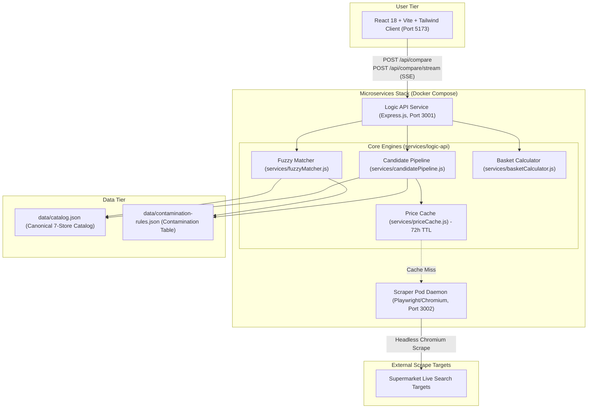
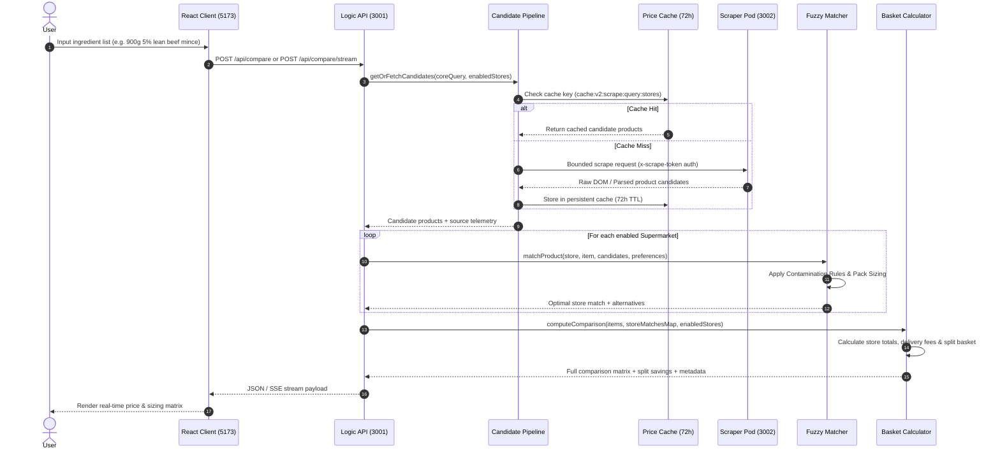

# ShoppingWise UK System Architecture & Technical Specifications 📐

ShoppingWise UK is an agentic, high-performance grocery price comparison and basket optimization engine designed to evaluate product prices, package sizing, and healthier dietary alternatives across 7 major UK supermarkets: **ASDA**, **Tesco**, **Sainsbury's**, **Morrisons**, **Iceland**, **Aldi**, and **Lidl**.

---

## 1. High-Level System Architecture

---

## 2. Component Pipeline & Data Flow

When a user submits a multi-item grocery list or searches for a single recipe ingredient, the request flows through the following pipeline:

---

## 3. Core Subsystems

### 3.1 Contamination Filter & Food Form Safety
To prevent cross-category contamination (e.g., Scotch eggs or mayonnaise matching fresh egg requests, or crisps matching fresh potatoes), matching is governed by a data-driven rules table in [`data/contamination-rules.json`](../data/contamination-rules.json):

- **Eggs**: Matches `egg`/`eggs`; strictly prohibits `scotch`, `mayo`, `mayonnaise`, `custard`, `creme egg`, `chocolate egg`, `noodles`, `sandwich filler`, `sweets`.
- **Potatoes**: Matches `potato`/`potatoes`; prohibits `crisps`, `chips`, `waffles`, `croquettes`, `potato salad in mayo`, `ready meal`, `snack`.
- **Milk**: Matches `milk`; prohibits `chocolate milk`, `milkshake`, `condensed`, `evaporated`, `powdered`, `flavoured`.
- **Greek Yogurt**: Matches `yogurt`/`yoghurt`/`greek`; prohibits `drink`, `corner`, `split pot`, `frubes`, `munch bunch`, `dessert`.
- **Raw Meat**: Matches raw cuts/mince; prohibits `canned`, `tinned`, `in gravy`, `pie filling`, `pet food`.
- **Garlic & Spinach**: Prohibits `garlic bread`/`baguettes` for fresh bulbs, and `pasta bake`/`pie` for fresh spinach leaves.

### 3.2 Closest-Pack Sizing Engine
The algorithm calculates:
$$\text{Packs Needed} = \left\lceil \frac{\text{Target Quantity}}{\text{Package Size}} \right\rceil$$
Unit prices (£/kg or £/L) are computed uniformly to allow accurate comparison between differing multi-pack formats and individual units.

### 3.3 Smart Split-Basket Optimization
Identifies the minimum-cost two-store combination when shopping across multiple supermarkets, accounting for minimum delivery thresholds and per-item lowest prices.
