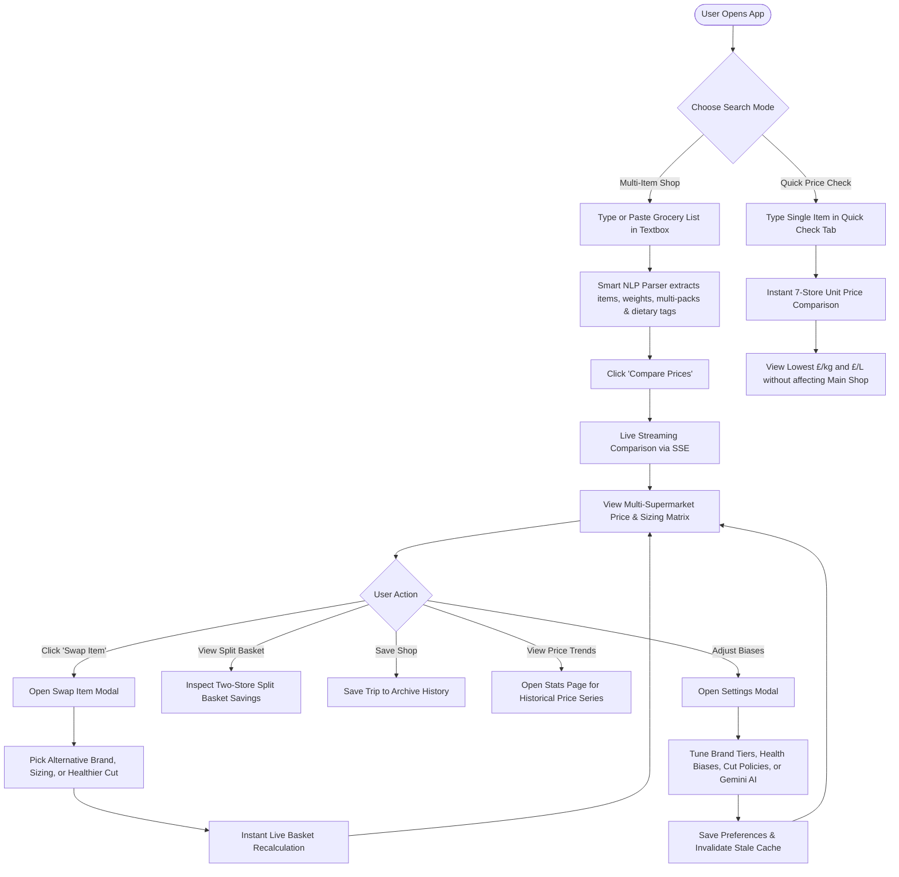

# User Journey & Interactive Workflow 🛒

This document illustrates the end-to-end user experience and state transitions in the application—from submitting an ingredient list to exploring multi-supermarket prices, swapping items, and optimizing basket costs.

---

## 1. End-to-End User Interaction Flow

---

## 2. Interactive Feature Walkthrough

### 2.1 Natural Language Grocery List Input
- Users enter unstructured lists (e.g. `900g 5% lean beef mince`, `3 x 400g chopped tomatoes`, `6 large free range eggs`, `semi skimmed milk 2 pints`).
- The parser extracts unit quantities, container multipliers, and dietary requirements.

### 2.2 Multi-Supermarket Price Matrix
- Displays side-by-side product matches across 7 UK supermarkets: **Asda**, **Tesco**, **Sainsbury's**, **Morrisons**, **Iceland**, **Aldi**, and **Lidl**.
- Includes true normalized unit prices (`£/kg`, `£/L`), package configurations, and active promotions (e.g. Clubcard, Nectar, Multibuy, BOGOF).

### 2.3 Interactive "Swap Item" Modal
- Allows users to replace any matched product with alternative pack sizes, brand tiers, or dietary equivalents.
- Immediate client-side re-indexing updates the overall basket totals and store rankings instantly.

### 2.4 Split-Basket Optimization
- Identifies the optimal two-supermarket split to achieve maximum savings when dividing shopping items across two nearby stores.

### 2.5 Quick Price Check & Historical Stats
- **Quick Check Tab**: Perform standalone product lookups across supermarkets without overwriting the active weekly shopping list.
- **Stats & Trends Tab**: Track win frequencies, match provenance breakdown, and per-item historical price trends over time.
