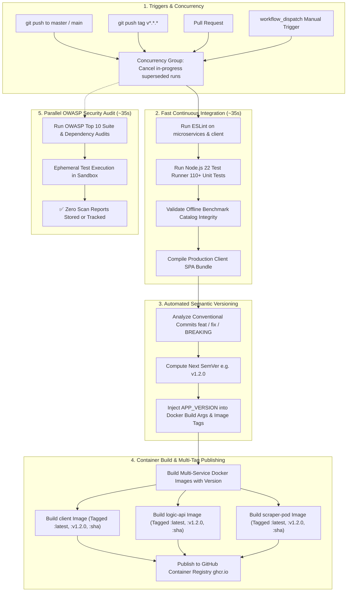

# GitHub Actions CI/CD, Versioning & Security Workflows 🛠️

This document details the automated continuous integration, conventional-commit semantic versioning, containerization, and security audit pipelines configured for ShoppingWise.

---

## 1. Automated CI/CD & Semantic Release Architecture

---

## 2. Pipeline Stages

### 2.1 Concurrency Cancellation
- **`cancel-in-progress: true`**: Automatically cancels older in-progress runs when rapid commits are pushed, saving runner minutes and eliminating pipeline queue congestion.

### 2.2 Fast Verification Job (`Lint, Test & Build`)
- Executes on every push and pull request.
- Installs dependencies with `npm ci`, runs ESLint, executes the full unit test suite (110+ tests), verifies offline catalog data integrity, and compiles the frontend production bundle.

### 2.3 Automated Semantic Versioning
- Uses Conventional Commits to automatically calculate the next SemVer version (`major`, `minor`, `patch`):
  - `feat:` $\rightarrow$ Minor bump (e.g. `1.1.0` $\rightarrow$ `1.2.0`)
  - `fix:`, `refactor:`, `perf:`, `chore:` $\rightarrow$ Patch bump (e.g. `1.2.0` $\rightarrow$ `1.2.1`)
  - `BREAKING CHANGE:` or `feat!:` $\rightarrow$ Major bump (e.g. `1.2.0` $\rightarrow$ `2.0.0`)
- Automatically injects the calculated version into Docker build arguments (`APP_VERSION`) and image tags.

### 2.4 Multi-Tagged Container Publishing
- Builds and pushes all 3 production images (`client`, `logic-api`, `scraper-pod`) to GitHub Container Registry (`ghcr.io`).
- Pushes multi-tag manifests:
  - `:latest` (Always tracks the newest build)
  - `:v1.2.0` & `:1.2.0` (Semantic release versions)
  - `:<commit-sha>` (Immutable commit artifact tag)

### 2.5 Ephemeral OWASP Security Audits
- Runs in parallel on code pushes.
- Evaluates OWASP Top 10 security rules, route validation, SSRF protections, credential redactions, and high-severity dependency audits without uploading artifacts or storing scan outputs.
