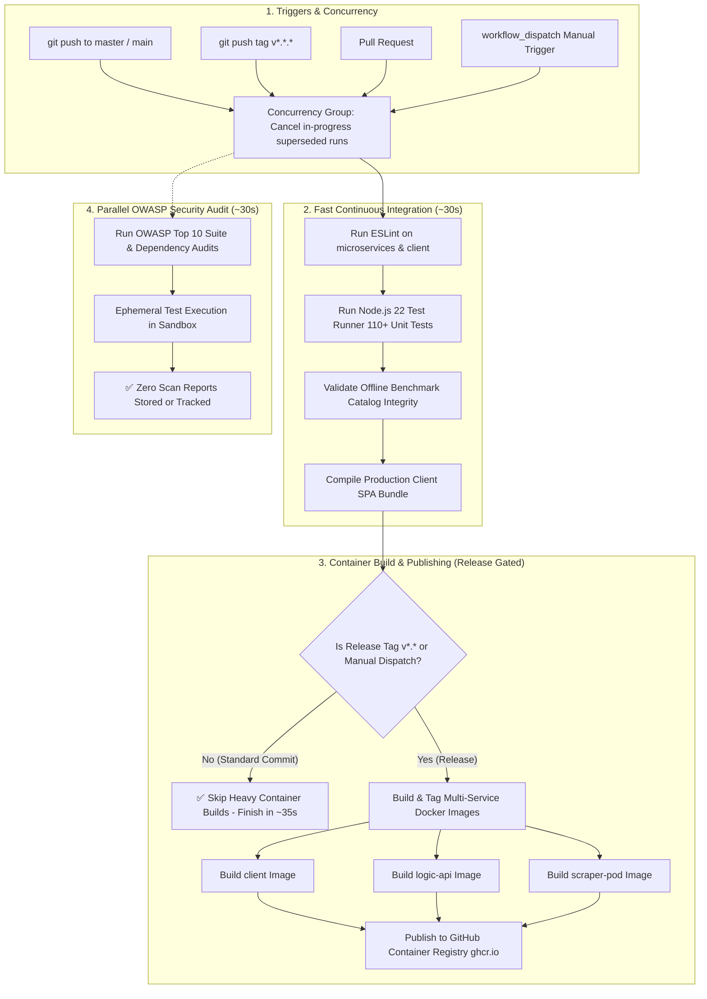

# GitHub Actions CI/CD & Security Workflows 🛠️

This document details the automated continuous integration, containerization, and security audit pipelines configured for the repository.

---

## 1. Automated CI/CD Pipeline Architecture

---

## 2. Pipeline Stages

### 2.1 Concurrency Cancellation
- **`cancel-in-progress: true`**: Automatically cancels older in-progress runs when rapid commits are pushed, saving runner minutes and eliminating pipeline queue congestion.

### 2.2 Fast 30-Second Verification Job
- Executes on every push and pull request.
- Installs dependencies with `npm ci`, runs ESLint, executes the full unit test suite (110+ tests), verifies offline catalog data integrity, and compiles the frontend production bundle.

### 2.3 Gated Container Image Publishing
- Container images (`client`, `logic-api`, `scraper-pod`) are built and pushed to GitHub Container Registry (`ghcr.io`) **only** on:
  - **Release Tags**: Pushing a SemVer release tag (e.g. `git tag v1.1.0 && git push origin v1.1.0`).
  - **Manual Dispatch**: Triggering "Run workflow" with `publish_containers: true` from the GitHub Actions UI.
- Normal feature/fix commits complete in ~35 seconds without generating redundant container image churn.

### 2.4 Ephemeral OWASP Security Audits
- Runs in parallel on code pushes.
- Evaluates OWASP Top 10 security rules, route validation, SSRF protections, credential redactions, and high-severity dependency audits without uploading artifacts or storing scan outputs.
